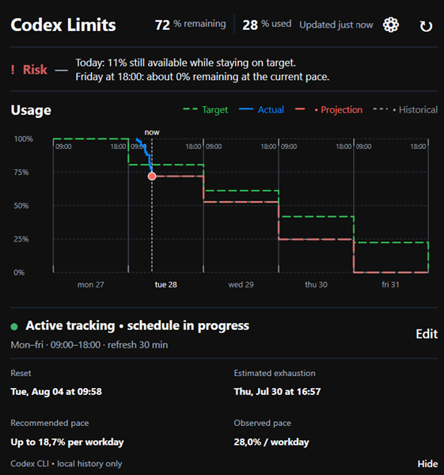

# Codex Limits Windows

Application Windows locale qui affiche le quota Codex restant, mesure le rythme de consommation et projette le quota disponible jusqu’à la fin d’un planning de travail configurable.



> [!IMPORTANT]
> **Projet indépendant et non officiel.** Codex Limits Windows n’est ni affilié, ni approuvé, ni soutenu par OpenAI. Les prévisions sont des estimations locales et ne garantissent ni la disponibilité future du service, ni l’exactitude des limites fournies par Codex.

## Fonctionnalités

- lecture du quota via l’interface locale documentée de `codex app-server` ;
- pourcentage restant et consommé ;
- cible journalière, consommation réelle, projection actuelle et historique ;
- estimation du quota restant à la fin du planning ;
- quota encore utilisable aujourd’hui pour rester sur la cible ;
- planning configurable : jours, horaires et fréquence d’actualisation ;
- réserve de sécurité configurable ;
- historique local limité à 90 jours, avec suppression des anciens fichiers au chargement ;
- français et anglais ;
- fonctionnement en arrière-plan dans la zone de notification Windows ;
- icône et infobulle avec quota total restant et quota encore utilisable aujourd’hui.

## Fonctionnement en arrière-plan

Fermer, réduire ou masquer la fenêtre ne termine pas l’application. Au premier passage en arrière-plan, un message explique ce comportement.

- double-clique sur l’icône de la zone de notification pour rouvrir la fenêtre ;
- clic droit → **Quitter** pour arrêter complètement le processus ;
- `scripts/run-background.ps1` démarre directement l’application sans afficher la fenêtre principale.

Le lancement automatique avec Windows n’est pas activé par défaut.

## Confidentialité

Codex Limits Windows n’intègre aucune télémétrie, publicité ou analyse distante. L’application ne lit ni les prompts, ni les conversations, ni les fichiers de travail Codex.

Les données locales sont stockées dans :

```text
%LOCALAPPDATA%\CodexLimitsWindows\
├── settings.json
├── ui-state.json
└── History\*.jsonl
```

L’historique contient uniquement :

- l’heure d’observation ;
- le pourcentage de quota restant ;
- l’heure de reset annoncée.

Pour supprimer toutes les données locales : quitte l’application, puis supprime `%LOCALAPPDATA%\CodexLimitsWindows`.

Consulte [PRIVACY.md](PRIVACY.md) pour la politique complète.

## Prérequis

- Windows 10 ou Windows 11 ;
- Codex CLI installé, accessible dans le `PATH` et connecté ;
- SDK .NET 8 pour compiler depuis les sources.

L’application lance localement :

```text
codex app-server --listen stdio://
```

puis lit `account/rateLimits/read`. Cette surface est documentée dans le dépôt officiel Codex :

- https://github.com/openai/codex/blob/main/codex-rs/app-server/README.md

## Lancer depuis les sources

```powershell
powershell.exe -NoProfile -ExecutionPolicy Bypass -File .\scripts\run.ps1
```

### Lancer directement en arrière-plan

```powershell
powershell.exe -NoProfile -ExecutionPolicy Bypass -File .\scripts\run-background.ps1
```

### Mode démonstration

```powershell
powershell.exe -NoProfile -ExecutionPolicy Bypass -File .\scripts\run-demo.ps1
```

## Compiler et tester

```powershell
dotnet build .\CodexLimits.Windows.sln --configuration Release
powershell.exe -NoProfile -ExecutionPolicy Bypass -File .\scripts\test.ps1
```

## Créer une distribution autonome

```powershell
powershell.exe -NoProfile -ExecutionPolicy Bypass -File .\scripts\publish-exe.ps1
```

Le script :

1. exécute le build Release et les smoke tests ;
2. publie une application autonome `win-x64` ;
3. copie les licences et documents de confidentialité ;
4. crée une archive ZIP et un fichier SHA-256 dans `artifacts\release`.

L’archive produite n’est pas signée par défaut. Pour une distribution publique, signe l’exécutable avec un certificat Authenticode reconnu ou utilise un canal de distribution qui signe le package.

## Limites connues

- les formats renvoyés par le Codex CLI peuvent évoluer ;
- les prévisions deviennent plus fiables après plusieurs échantillons locaux ;
- une consommation très irrégulière peut rendre la projection moins représentative ;
- Windows peut afficher un avertissement SmartScreen pour un exécutable non signé ;
- le nom du projet conserve le terme « Codex » à titre descriptif. Consulte [TRADEMARKS.md](TRADEMARKS.md).

## Structure

```text
src/
├── CodexLimits.App/       Interface WPF, paramètres, icône système
└── CodexLimits.Core/      Lecture du quota, planning, prévisions, historique

tests/
└── CodexLimits.SmokeTests/

docs/
├── icon.png
├── icon.ico
├── codex-limits.png
└── RELEASE_CHECKLIST.md
```

## Sécurité

Ne publie jamais de sortie brute Codex, de capture contenant des informations de compte, de jeton ou de fichier local dans une issue publique. Consulte [SECURITY.md](SECURITY.md).

## Crédits

Ce port Windows reprend des idées et une partie de la logique de prévision du projet macOS [`thrr87/codex-limits`](https://github.com/thrr87/codex-limits), distribué sous licence MIT.

L’avis de licence d’origine est conservé dans [THIRD_PARTY_NOTICES.md](THIRD_PARTY_NOTICES.md).

## Licence

Codex Limits Windows est distribué sous licence MIT. Voir [LICENSE](LICENSE).
